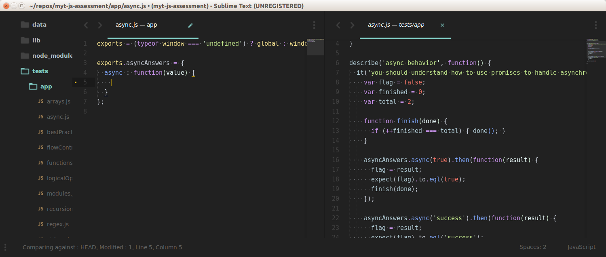

# A test-driven JS assessment

This repository contains a set of tests that is used to assess the skills of a candidate for a JavaScript position, it has been reduced to a subset of tests that are deemed most relevant for a beginner -> intermediate developer.

## Before starting

To begin the excercises, fork this repository on your own github account, then clone it to your local machine. When you've completed the excercises, simply download a ZIP of your solutions and send it via e-mail to your contact. Please do _not_ submit a public pull request, as other candidates will have access to these.

## I want to work on the tests; what do I do?
To use the tests, you will need to install Node -- you can do this via the
[download page](https://nodejs.org/download/) or using
[Homebrew](http://mxcl.github.com/homebrew/) if you are on a Mac.

Note that on Windows, there are some reports that you will need to restart
after installing Node - see #12.

You can clone or download this repo. Once you have done so, from the root
directory of the repo, run:

    npm install
    npm start

You can then view the tests in your browser at
[http://localhost:4444](http://localhost:4444).

When you visit that page, all of the tests should be failing; your job is to
get the tests to pass. To do this, you'll need to refer to the tests in the
files in the `tests/app` directory, and edit the files in the `app/` directory.
Once you update a test, you can reload the test page in the browser to see
whether it worked.

You can also run (most of) the tests on the command line:

    npm test

The command line runner is a work in progress; contributions welcome :)

You can also develop with live-reload and grunt-watch if that's your thing:

    npm install -g grunt-cli
    npm install
    grunt develop

## How to work with these tasks

One way of working with these excercises is to open up the `app/<filename-a>.js`, and the `tests/app/<filename-a>.js`. By reading the test written in the `tests/..` folder and the comments in the `app/..` folder, you will be able to understand what is expected of you in order to solve each test.

Having a split screen text editor can greatly help like shown below.

After completing all tasks, `localhost:4444` should only show green test cases.

## I need help!

If there's anything unclear in the excercises, if you want to confirm something or any other question - don't hesitate to contact André at andre@keepersolutions.com

### Available dependencies

The repo includes jQuery, Backbone, and Underscore. Do take advantage of these
libraries when writing your solutions!

# License

Copyright &copy; 2012-2015 Rebecca Murphey.

This work is licensed under a <a rel="license" href="http://creativecommons.org/licenses/by-sa/4.0/">Creative Commons Attribution-ShareAlike 4.0 International License</a>.
